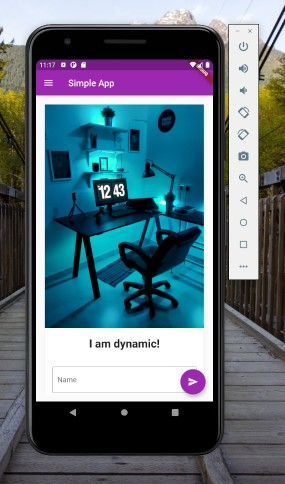

# simple_flutter_app

A simple Flutter project which makes use of drawer widget and a text box which accepts any input and displays the same on screen.

The application makes use of Flutter, Dart plugins provided by Visual Studio Code.

## Run the project

- Set up flutter on your development machine as defined here: https://flutter.dev/docs/get-started/install

- Install Flutter and dart plugins: https://flutter.dev/docs/get-started/editor?tab=vscode

- Clone the project: `git clone git@github.com:ArifaMujawar/simple_flutter_app.git`
- Open the project using Visual Studio Code.

- Install dependencies by running `Flutter: Get Packages` from command palette of Visual Studio Code.
- Go to the main.dart file present in lib folder, find `Run without debugging` button and select appropriate device to start.
